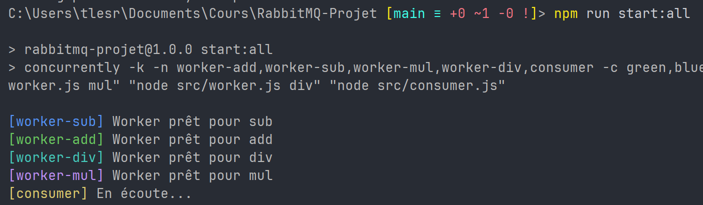
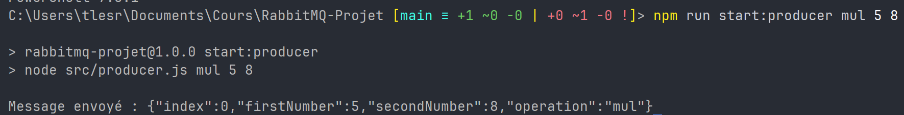
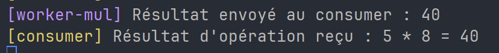

# RabbitMQ-Projet

## Auteurs

- Thomas L. - 20230012
- David W. - 20230637
- Antoine H. - 20230367

## Concept

Ce projet est une démonstration de l'utilisation de RabbitMQ pour la gestion de tâches asynchrones. Il met en œuvre un système de calcul distribué où les tâches sont envoyées par un producteur et traitées par des workers. Le consumer récupère les résultats et les affiche.

## Installation du projet

1. Cloner le projet
```bash
git clone https://github.com/Orden14/RabbitMQ-Projet.git
```

2. Se placer dans le dossier du projet
```bash
cd RabbitMQ-Projet
```

3. Installer les dépendances
```bash
npm install
```

4. Pull et run RabbitMQ via Docker  
/!\ Si vous utilisez votre propre instance RabbitMQ, vous pouvez sauter cette étape et configurer les variables d'environnement dans le fichier `.env`
```bash
docker run -it --rm --name rabbitmq -p 5672:5672 -p 15672:15672 rabbitmq:4-management
```

5. Lancer le projet  
Suivre le guide des commandes ci-dessous pour démarrer les différents composants du projet.

## Liste des commandes

Lancer le consumer et les 4 workers en même temps (grace au package `concurrently` qui permet d'exécuter plusieurs commandes en parallèle dans un seul terminal)
```bash
npm run start:all
```

Lancer le consumer uniquement
```bash
npm run start:consumer
```

Lancer un worker spécifique (arguments optionnels)
```bash
npm run start:worker <add/sub/mul/div>
```

Lancer le producer (arguments optionnels)
```bash
npm run start:producer <add/sub/mul/div/all> <int> <int>
```

## Utilisations du producer

### Argument 1
- `add` : Additionne les deux entiers
- `sub` : Soustrait le deuxième entier du premier
- `mul` : Multiplie les deux entiers
- `div` : Divise le premier entier par le deuxième
- `all` : Envoie les quatre opérations (addition, soustraction, multiplication, division) avec les deux entiers

### Argument 2 et 3
Entiers à utiliser pour les opérations. Si aucun entier n'est fourni, le producer utilisera des valeurs aléatoires.

### Commande sans arguments
Si aucune commande n'est spécifiée, le producer enverra en boucle des opérations aléatoires de deux entiers aléatoires.

## Exemple d'utilisation

Je lance d'abord mon consumer et mes 4 workers
```bash
npm run start:all
```



Dans un autre terminal, je lance mon producer pour envoyer une multiplication de 5 par 8
```bash
npm run start:producer mul 5 8
```



Je peux ensuite lancer mon producer en mode automatique pour envoyer des opérations aléatoires
```bash
npm run start:producer
```

Je peux enfin consulter les résultats dans le terminal du consumer et des workers pour voir les opérations effectuées et les résultats.

